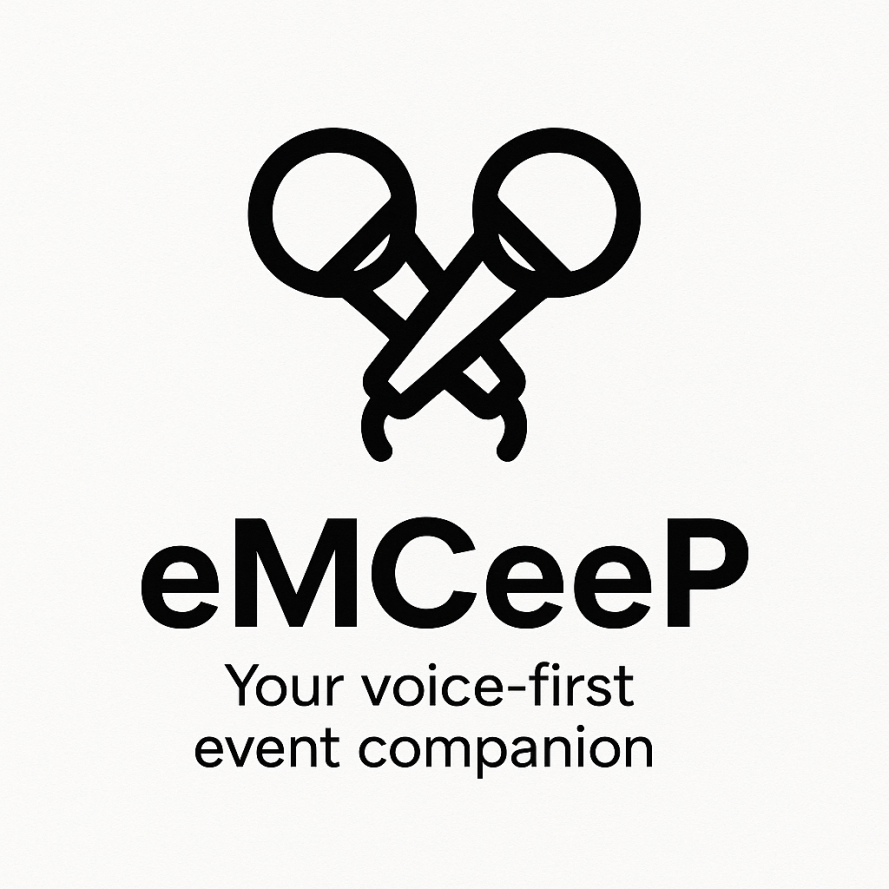

# 🎤 eMCeeP - Your AI Event Management Assistant

*Your upbeat, always-there-for-you emcee in your pocket*

## 🌟 Overview

eMCeeP is an intelligent, voice-activated AI assistant designed specifically for busy event organizers who need to manage their events seamlessly, efficiently, and without missing a beat. Whether you're juggling multiple events, dealing with last-minute changes, or fielding endless attendee questions, eMCeeP is your 24/7 digital emcee that keeps everything running smoothly.

## 🚀 Key Features

### 🗣️ **Voice & Chat Management**
- **Voice Commands**: Speak naturally to update events, modify details, or send notifications
- **Chat Interface**: Type quick updates when voice isn't convenient
- **Natural Language Processing**: No need to learn commands - just talk to eMCeeP like you would a human assistant

### 📅 **Event Management Made Easy**
- **Real-time Updates**: Modify event details instantly across all platforms
- **Bulk Notifications**: Send updates to all attendees with a simple voice command
- **Schedule Changes**: Reschedule, relocate, or modify events effortlessly
- **Attendee Management**: Add, remove, or update attendee information on the fly

### 🤖 **Smart Attendee Support**
- **24/7 Availability**: Attendees can message or call eMCeeP anytime for event information
- **Instant Responses**: Get immediate answers about schedules, locations, requirements, and more
- **FAQ Learning**: eMCeeP learns from common questions and provides better responses over time

### 🔔 **Intelligent Escalation**
- **Priority Detection**: Identifies important or frequently asked questions
- **Smart Notifications**: Calls you when attendee concerns need your personal attention
- **Trend Analysis**: Spots patterns in attendee questions to help you proactively address issues

## 💼 Perfect For

- **Conference Organizers** managing multi-day events with hundreds of attendees
- **Wedding Planners** coordinating complex timelines and vendor communications  
- **Corporate Event Managers** handling last-minute executive schedule changes
- **Community Event Coordinators** managing volunteer schedules and public communications
- **Trade Show Organizers** dealing with exhibitor questions and logistics

## 🎯 How It Works

### For Event Organizers:
1. **Set Up Your Event**: Tell eMCeeP about your event details via voice or chat
2. **Make Changes Instantly**: "eMCeeP, move the keynote from 2 PM to 3 PM and notify everyone"
3. **Stay Informed**: Receive calls when important attendee questions arise
4. **Focus on What Matters**: Let eMCeeP handle routine communications while you focus on strategic decisions

### For Attendees:
1. **Get Instant Answers**: Message or call eMCeeP for real-time event information
2. **Receive Updates**: Get notified immediately when event details change
3. **Ask Follow-ups**: Natural conversation flow for complex questions
4. **Access 24/7**: Get support even when organizers are busy or offline

## 🌈 Use Cases

### Scenario 1: Last-Minute Venue Change
*"eMCeeP, the main hall is flooded. Move the conference to Conference Room B and notify all 200 attendees immediately."*

**Result**: eMCeeP instantly updates the event page, sends notifications via email/SMS, and is ready to answer attendee questions about the change.

### Scenario 2: Speaker Cancellation
*"eMCeeP, Dr. Smith canceled. Replace her 3 PM slot with the panel discussion and extend networking by 30 minutes."*

**Result**: Schedule automatically updated, attendees notified, and eMCeeP briefed to handle questions about the program change.

### Scenario 3: Common Question Management
**Attendee calls**: *"What's the WiFi password?"*
**eMCeeP responds**: *"The WiFi network is 'EventWiFi' and the password is 'Connect2024'. Is there anything else about the venue I can help you with?"*

When 15+ people ask the same question, eMCeeP calls you: *"Hi! Many attendees are asking about parking. Should I add this to the event page FAQ?"*

## 🔧 Technical Features

- **Multi-Modal Interface**: Voice, chat, and API integrations
- **Real-time Synchronization**: Updates reflect instantly across all platforms
- **Smart Learning**: Improves responses based on your event patterns
- **Integration Ready**: Works with popular event management platforms
- **Secure & Private**: Enterprise-grade security for sensitive event data
- **Mobile Optimized**: Full functionality on smartphones and tablets

## 🎉 Benefits

✅ **Save Time**: Reduce administrative overhead by 70%  
✅ **Reduce Stress**: Never worry about missing important attendee communications  
✅ **Improve Experience**: Attendees get instant, accurate information 24/7  
✅ **Stay Flexible**: Make changes on the go without disrupting your workflow  
✅ **Scale Efficiently**: Handle larger events without proportionally more staff  
✅ **Professional Image**: Always-responsive, consistent communication with attendees  

## 🚦 Getting Started

1. **Sign Up**: Create your eMCeeP account
2. **Connect Your Events**: Import existing events or create new ones
3. **Train Your Assistant**: Spend 10 minutes teaching eMCeeP about your event specifics
4. **Go Live**: Start managing your events with voice commands and let attendees interact with eMCeeP
5. **Optimize**: Review eMCeeP's suggestions and insights to improve future events

## 🏆 Why eMCeeP?

Event management is complex, unpredictable, and demanding. eMCeeP transforms the chaos into controlled, efficient operations by being your always-available, intelligent assistant that speaks your language - literally. 

Stop juggling phones, emails, and spreadsheets. Start having conversations with your events.

**eMCeeP: Because every great event deserves a great emcee.**

---

*Ready to revolutionize your event management? Get started with eMCeeP today!*

## 📞 Contact & Support

- **Website**: [Coming Soon]
- **Email**: hello@emceep.ai
- **Support**: Available 24/7 through eMCeeP itself!

---

*Built with ❤️ for event organizers who deserve better tools*